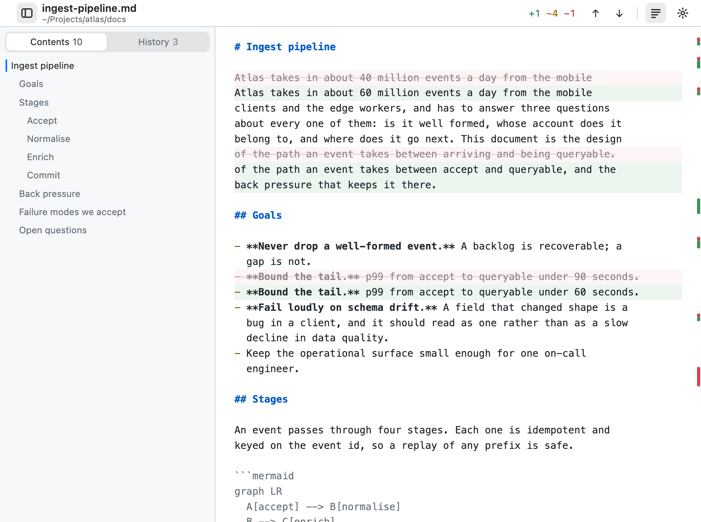
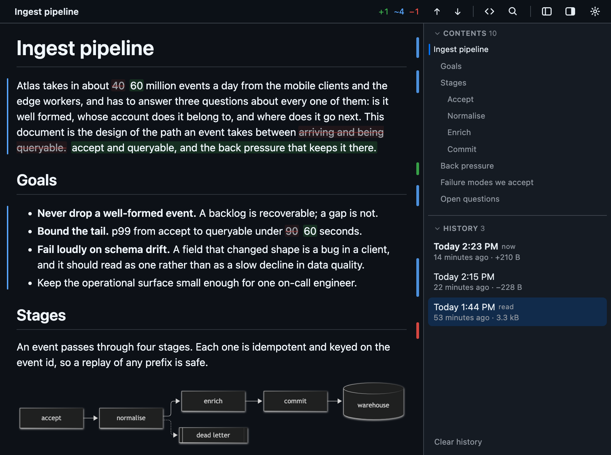

<p align="center">
  
</p>

<h1 align="center">Redline</h1>

<p align="center">
  <strong>A markdown reader with a memory.</strong>
  <br>
  It remembers every version of a file it has shown you, and marks what changed since
  you last read it: word by word, in the prose, without touching git.
</p>

<p align="center">
  <a href="https://redline.iamtuna.org/#get"><strong>Download for macOS</strong></a>
  &nbsp;·&nbsp;
  <a href="https://redline.iamtuna.org/">Website</a>
  &nbsp;·&nbsp;
  <a href="docs/README.md">Documentation</a>
</p>

<p align="center">
  
  
  
  
</p>


## Which four paragraphs moved?

An agent has just rewritten your design doc. A colleague pushed a new revision of
the spec. You saved over your own notes an hour ago and can't remember what you
touched. Today you either *reread the whole thing*, or you *commit after every
edit* and fill the log with noise nobody wants.

Redline does neither. Each time it shows you a file it quietly takes a snapshot.
It diffs what is on disk now against the version you last read, and marks only what
moved: a bar in the margin, and the changed words struck through and tinted in
place. The rest of the page stays ordinary prose. An edit takes seconds to review
instead of a careful pass over everything.

It's review mode, the way Google Docs or Word has it, for a plain `.md` file on your
disk. A *redline*, in the sense an editor means it.

- **The diff is in the prose, not beside it.** No side-by-side panes and no patch
  syntax. The document still reads like a document.
- **You work a review down to zero.** Check off each change as you read it, and the
  count drops until nothing is left.
- **"Since" is your choice.** Compare against the last time you read it, against
  git `HEAD`, or against any version in the history.
- **Git history comes free.** A tracked file opens with its last 50 commits already
  in the list, followed across renames.
- **Nothing leaves the machine.** Your file is only ever read. Nothing is written
  next to it, and the app sends no data anywhere.

## Install

```sh
brew install --cask tuanchauict/tap/redline
```

Or [download the `.dmg`](https://redline.iamtuna.org/#get) and drag it to
Applications. It needs macOS 11 or later and is one universal app for Apple silicon
and Intel. It is signed and notarized, so it opens on the first double-click without
a Gatekeeper prompt.

Then open a file however you like: `open -a Redline notes.md`, drop it on the
window, **⌘O**, or make Redline the default app for `.md` and double-click it in
Finder. Several files at once become tabs. Upgrading is `brew upgrade --cask redline`,
or **Redline ▸ Check for Updates…**, which only checks when you click it.

<details>
<summary><strong>Run it from source, in a browser tab or a native window</strong></summary>

<br>

In a browser, with Node 18+ and no build toolchain:

```sh
npm install
npm start -- path/to/doc.md        # or: npm link && redline doc.md
```

As the Mac app, with a [Rust toolchain](https://rustup.rs) as well:

```sh
npm run app -- path/to/doc.md      # a native window, from this checkout
npm run bundle                     # dist/Redline.app and a .dmg to share
```

Flags, ports and environment variables are in [Command line](docs/cli.md).

</details>

## Reviewing an edit


- **Marks that read like an editor's.** A changed paragraph gets a thin bar in the
  left margin: green for added, blue for changed, red for removed. Inside it, only
  the words that moved are struck through and tinted. `+3 ~1 −2` on the bar shows
  how much has changed. The diff runs on the rendered page, so a mark never cuts
  through a link or a run of bold text.
  → [Change marks](docs/changes.md)

- **Check a change off.** Press `c`, or click the label in the margin, and the mark
  goes away. It stops being counted, and `n` / `p` skip past it. A heavily edited
  file gets worked *down* to nothing, instead of staying covered in highlighting
  that is as loud at the end as it was at the start. A checked change stays checked
  when the text around it moves. `⇧C` brings them all back.
  → [Checking a change off](docs/changes.md#checking-a-change-off)

- **Every change on the scrollbar.** The same three colours run down the right
  edge, at the scale of the whole file. You can see at a glance whether it was
  edited throughout or in three paragraphs near the end.
  → [The ruler](docs/changes.md#the-ruler)

- **Compare against anything.** Last read, git `HEAD`, or any version in the list.
  `m` marks what you've seen as read. `d` hides the marks for a clean read, and
  nothing is lost while they are hidden.
  → [Comparing against something else](docs/changes.md#comparing-against-something-else)

- **Every version, in one list.** Each row is named by its commit subject, or by the
  time it was saved, and shows how much the file grew or shrank. Click a row to
  compare against it. The choice is remembered for that file, even across restarts.
  → [History](docs/history.md)

## A reader first

Redline is also just a good way to read markdown, even when nothing has changed.

- **GitHub-style rendering.** It uses `github-markdown-css`, syntax highlighting,
  tables, task lists and `> [!NOTE]` alerts.
- **Rendered or raw, one key apart.** `r` shows the markdown source, highlighted
  and marked line by line. Switching keeps the *line of the file* you were on, not
  just the scroll position, so you land on the sentence you left.
- **Front matter as a card.** A `---` header, such as a skill's `name` and
  `description` or a post's `title`, is shown as a neat card of fields instead of
  stray prose. The bar calls the document by its title, not by `README.md`.
- **Live reload that keeps your place.** Put an editor on one side and Redline on
  the other, and they stay in step. A red dot appears only if the watch drops.
- **Two sidebars.** The open files sit on the left (**⌘B**). The document's
  headings and its version history share the right (**⌥⌘B**), with the section you
  are reading highlighted as you scroll. Drag either edge to the width your paths
  and commit subjects need.
  → [The sidebars](docs/reading.md#the-sidebars)
- **Links that work.** `./api.md` and `../adr/0004.md` resolve against the folder
  the document is in, so links to other files open. Hover any link to see where it
  goes before you click.
- **Diagrams, offline.** `mermaid` fences render in the page, and `plantuml` fences
  render to inline SVG on your machine, never sent to a remote server. Both redraw
  when the theme changes.
  → [Diagrams](docs/diagrams.md)
- **Find and print.** `⌘F` searches the document on screen. `⌘P` prints a clean
  page, without the toolbar or sidebars.
- **Your typography.** Light, dark or sepia. Any typeface installed on your Mac,
  text from 11 to 24 px, and three column widths.
  → [Settings](docs/native-window.md#settings)
- **A native window with no title bar.** The traffic lights sit in the reader's own
  toolbar. Tabs run down the side, so two `README.md`s are labelled by their folder
  and stay easy to tell apart. Quit and relaunch, and the files you were reading
  come back.
  → [The native window](docs/native-window.md)

<table>
  <tr>
    <td width="50%"></td>
    <td width="50%"></td>
  </tr>
  <tr>
    <td align="center"><sub>The raw view: the source, marked line by line.</sub></td>
    <td align="center"><sub>Dark mode, diagrams included.</sub></td>
  </tr>
</table>

### Keys

| | | | |
| --- | --- | --- | --- |
| `n` / `p` | next / previous change | `r` | rendered ⇄ raw |
| `c` | check a change off | `d` | marks on / off |
| `⇧C` | bring every change back | `m` | mark read |
| `⌘B` | open files | `⌘F` | find |
| `⌥⌘B` | contents and history | `⌘,` | settings |

Every key and menu shortcut is in [Keyboard](docs/keyboard.md).

## Private by construction

- **Your file is only ever read.** There is no edit mode, and nothing is written
  next to it. Snapshots live in `~/.redline`, outside your project, and the store
  cleans up after itself.
- **The git import only reads the repository.** It never commits, stashes or
  touches the index.
- **No network.** The renderer, highlighter, styles and Mermaid are all bundled,
  and PlantUML only ever runs locally, so a document renders the same with Wi-Fi
  off. In a browser tab, the local server listens on `127.0.0.1` only.
- **One request, and only when you ask.** **Check for Updates…** fetches a small
  `latest.json` that says which version is newest. It never runs on launch or on a
  timer, and it sends nothing about you or your documents.

## Under the hood

**One reader, two shells.** Everything that decides what a document *is* (the
renderer, the diff, the snapshot store, the git import) is plain JavaScript that
runs anywhere. In a browser tab it runs in Node behind `node:http`. In the Mac app
it runs inside the webview, with no Node and no server at all. Each platform needs
just one adapter, and the code above it doesn't know which one it has. A tab and the
app can't disagree about what changed, because there is only one implementation.

**A small, native app.** The shell is Rust on [Tauri](https://tauri.app). It owns a
window, a menu and the disk, and knows nothing about documents. It uses the WebKit
that ships with macOS instead of bundling a browser, so the whole app is one binary
of about 8 MB per architecture. Most of that is the page compiled into it, and most
of the page is the Mermaid renderer.

**No framework, no transpiler, six dependencies.** What you read in `src/` and
`public/` is what runs: one client module and one hand-written stylesheet. The diff
works at two levels, blocks and then words, on top of markdown-it's own parser. The
word diff compares *rendered HTML* rather than markdown source, which is why a mark
never splits a link or a run of bold text.

**One test file, and it boots the real thing.** `test-smoke.js` has about 600
assertions, no test framework and no mocks. It starts the actual server on a temp
file, edits the file, and checks what comes back. Then it searches the client code
to make sure each feature is actually *wired up*, because a diff that is correct but
unreachable would otherwise pass.
→ [Architecture](docs/architecture.md) · [Building and testing](docs/building.md)

## Documentation

| | |
| --- | --- |
| [Reading a document](docs/reading.md) | The two views, the header card, find, print, the sidebars, live reload |
| [Change marks](docs/changes.md) | What the marks mean, how the diff is made, choosing a baseline, checking a change off |
| [History](docs/history.md) | Every version of a file, the git import, cleaning up, where it lives |
| [The native window](docs/native-window.md) | Windows, tabs, Settings, checking for updates |
| [Keyboard](docs/keyboard.md) | Every key and menu shortcut |
| [Diagrams](docs/diagrams.md) | Mermaid and PlantUML |
| [Command line](docs/cli.md) | Flags, ports, environment variables |
| [Architecture](docs/architecture.md) | How it is put together, for working on it |
| [Building and testing](docs/building.md) | `npm test`, the icons, shipping a `.dmg` |

Working on it? Start with [Architecture](docs/architecture.md), and
[Building and testing](docs/building.md) for the commands and the test suite.

## License

Apache License 2.0; see [`LICENSE`](LICENSE) and [`NOTICE`](NOTICE). The app and the
page include third-party packages under their own licenses, listed with their texts in
[`THIRD-PARTY-NOTICES.md`](THIRD-PARTY-NOTICES.md). To report a security problem, see
[`SECURITY.md`](SECURITY.md).
