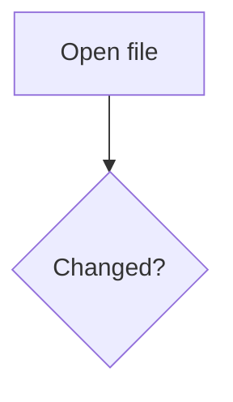

# Diagrams

## Mermaid

Works out of the box. The bundle is served from `node_modules`, so it works
offline, and it is loaded lazily — a document with no diagrams never fetches it. It
follows your light/dark theme. A diagram that fails to parse is marked in place
rather than breaking the page.

````markdown

````

## PlantUML

Rendered server-side to inline SVG, and only ever locally — nothing is sent to
plantuml.com or any other remote renderer. It needs a renderer present:

```
brew install plantuml                        # or
redline doc.md --plantuml-jar ~/plantuml.jar
PLANTUML_JAR=~/plantuml.jar redline doc.md   # or
cp plantuml.jar ~/.redline/                  # picked up with no flag
```

No jar is bundled, on purpose: PlantUML is GPL and ~30 MB, and a jar alone is not
enough — it still needs a JVM, and graphviz for anything but sequence diagrams. So
bundling one would remove none of the setup. `brew install plantuml` brings all
three; anything already installed is detected automatically.

Without a renderer, `plantuml` / `puml` / `uml` fences fall back to a highlighted
code block with a one-line note. Results are cached per diagram, so live reload does
not re-run the renderer for diagrams that did not change.

## In the diff

Diagrams take part in the diff like any other block: edit one and it is marked
changed, with the previous diagram behind the **before** disclosure. A diagram is
never word-diffed — see [Change marks](changes.md#how-the-diff-works).
