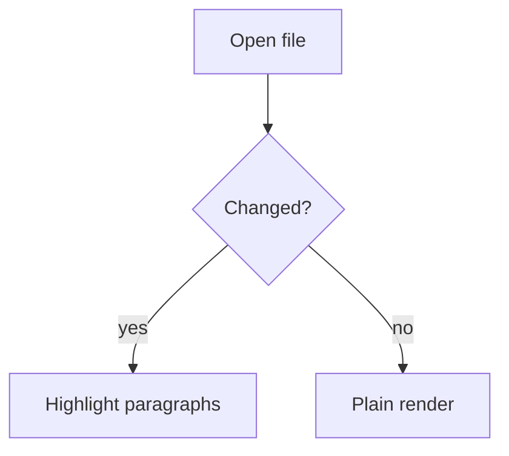

# Project Notes

Intro paragraph that stays exactly the same across versions.

## Goals

- ship v1
- keep the UI small

Some text that the AI will rewrite later on.

```js
const x = 1;
```

> [!NOTE]
> An alert block.

| a | b |
| --- | --- |
| 1 | 2 |



```plantuml
Alice -> Bob: hello
Bob --> Alice: hi
```

A paragraph that will be deleted entirely.
